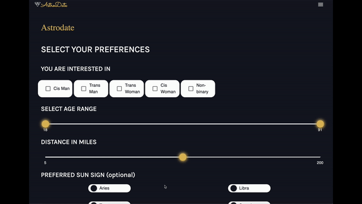

# AstroDate

This project was originally designed as part of my final project at Wyncode. Within in two weeks, our amazing three person dev team built out the foundation of this app based on the great desgins from our UXUI partners. After finals, I wanted to keep learning from the app and cloned it to improve the UI and functionality 

You can see the live version of this repo [here](https://itchonib-astrodate.herokuapp.com/). 

You can see the original repo [here](https://github.com/wyncode/c39_astro_match). 

This application allows users to meet others based on the compatibility of their astrological signs by creating a profile, inputting preferences,receving a match list, and chatting with other users.

## Tech Stack

This app was primarily build with MERN stack. [Material UI](https://material-ui.com/) was used to generate custom components like steppers, ranger sliders, and carousels. Socket.IO amd MongoDB change streams helped create the chat system. 

## APIs

- [Immanuel API] (https://immanuel.app/) was used to generate the astrological signs of users. 
- [Universial Tutorial] (https://www.universal-tutorial.com/) to generate the lists of countries, states, and cities used in sign ups 
-[Opendatasoft] was used to generate latitude and longitude of locations and zipcodes. (https://public.opendatasoft.com/explore/dataset/cities-and-towns-of-the-united-states/map/?location=2,51.73939,54.26715&basemap=jawg.streets)

## Additional dependencies and imports 

| BackEnd             | FrontEnd           |
| ------------------- | ------------------ |
| bcryptjs            | axios              |
| cloudinary          | Google Fonts       | 
| husky               | react              |
| express             | react-dom          |
| express-fileupload  | react-router-dom   |
| faker               | react-scripts      |
| jsonwebtoken        | web-vitals         |
| mongoose            | SweetAlert         |    
| passport            |        
| passport-jwt        |
| sendgrid            |
| validator           |
| zipcode-distance    |

## Screenshots and Gifs

Signup                               |  Preferences
:-----------------------------------:|:-----------------------------------:
     |  

## Setup

- `git clone` this repo.
- `cd` into it.
- `cd client && yarn install`

## Available Build Commands
- `yarn dev`: Runs BOTH your Express.JS and React developer environment locally at the same time. Any logs coming from Express will be prefaced with [0], any logs from - create-react-app will be prefaced with [1].
- `yarn server`: Runs JUST your Express.JS server.
- `yarn client`: Runs JUST your front-end React app.

